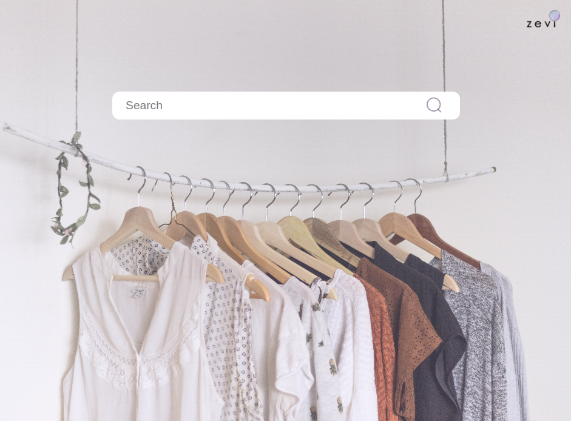
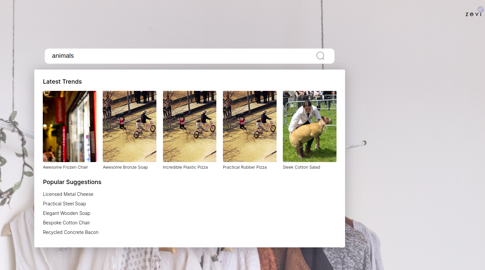
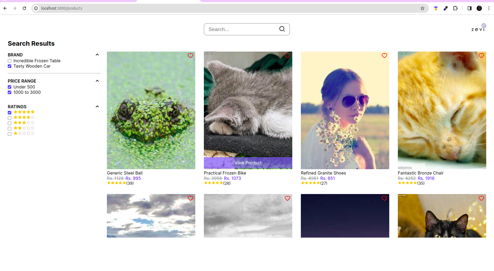
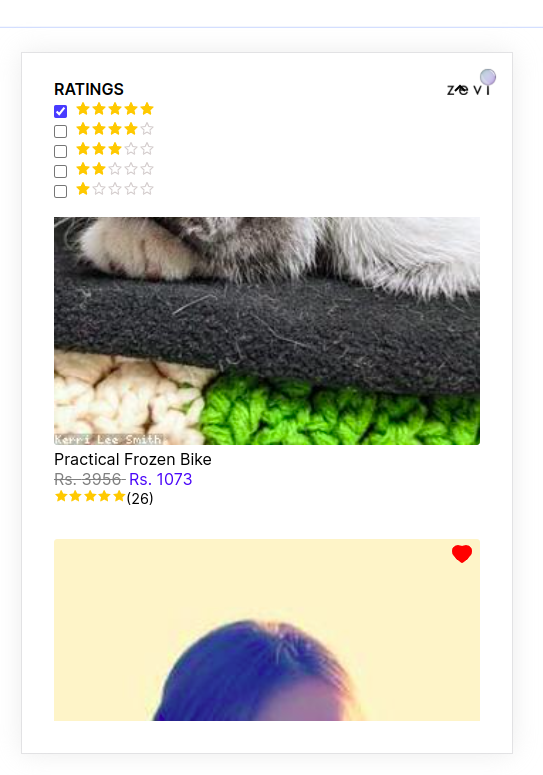

# Zevi Frontend Internship Assignment 
> This repo contains code for internship task @zevi 2023 Assignment




## React Dev Assignment -
1. You have to develop a demo react app (for mobile and web). Set up a React project using CRA and if you know TypeScript and SASS, use them - you’ll earn bonus points 
2. The app is a simplified search app with following requirements: 
Click on the search tab latest trend suggestion box open 
3. Implement faker api for showing data. 
According to the filter data should update. 
4. Click on the Wishlist colour should change to red 
On hovering to the product view product button should be visible.
5. The look & feel should match the design specs mentioned in this link here
Use atomic commits; so commit as much as you can!!
6. You have to use functional react components with hooks (No class components at all!!!)


## Submission
1. Create a github repo and give access to xxxx [sorry for secuiry purpose we can't share the email id]   Deploy your app using netlify
2. Once done, send us an email (with the link to the github repo you used for assignment). Also mention the link of the app deployed using netlify.

## How you’ll be scored:
* Finishing each requirement as mentioned above with as minimum bugs as possible
* Modularity - write reusable components as much as possible.
* How you have structured your project, your folder structure should be simple enough for anyone to go through your code. Use standards followed in most react projects.
* Readability of code, using homogeneous naming conventions (variable names should be self explanatory) and following general best practices
Correct git branching and frequent commits
Final result looks exactly as the given design and similar on different screen sizes
>Bonus Points:
Use of typescript
Minimum use of any, if using TS
Use of SASS for writing modular styles, using sass variables, functions and mixins


### Links
Frontend hosted at: https://pursottam6003-zevi.netlify.app/


## Solution Approach
1. The initial step involves creating a form with an aesthetically pleasing UI for uploading user details.

2. For the backend, it is crucial to design an architecture to store user details. The focus is on defining the structure and components of the backend architecture.

3. To establish a seamless connection between the frontend and backend, an Entity-Relationship diagram needs to be created. This diagram aids in comprehending the relationships between entities and serves as a guide for developing APIs to facilitate communication between the frontend and backend.

 

### Technologies Used
* ReactJS -cra temmplate
* TypeScript
* SASS 
* NodeJS
* Faker API


### Installation
* Clone the repository

```bash
git clone "https://github.com/Pursottam6003/zevi-app"

```
* Install the dependencies

```bash
npm install
```

Note : If it shows any error then only try to install the dependencies one by one using the following commands

```bash
npm install --force 
```


* Run the frontend server

```bash
npm start
```
* Open the browser and go to http://localhost:3000 

## Archietecture 
 It contains mainly frontend and we are using the faker api to generate the
    fake data and we are using the react hooks to manage the state of the application.


## Screenshorts 

To check the form validation here i have done the following checks 
* Latest trend suggestion box open
* 
 

* According to the filter data should update.


* Its also responsive for mobile view

## Author

- [@Pursottam6003](https://www.github.com/Pursottam6003)
- https://www.linkedin.com/in/pursottamsah/
- https://pursottam.github.io/


